# PF2e AI Combat Assistant for Foundry VTT

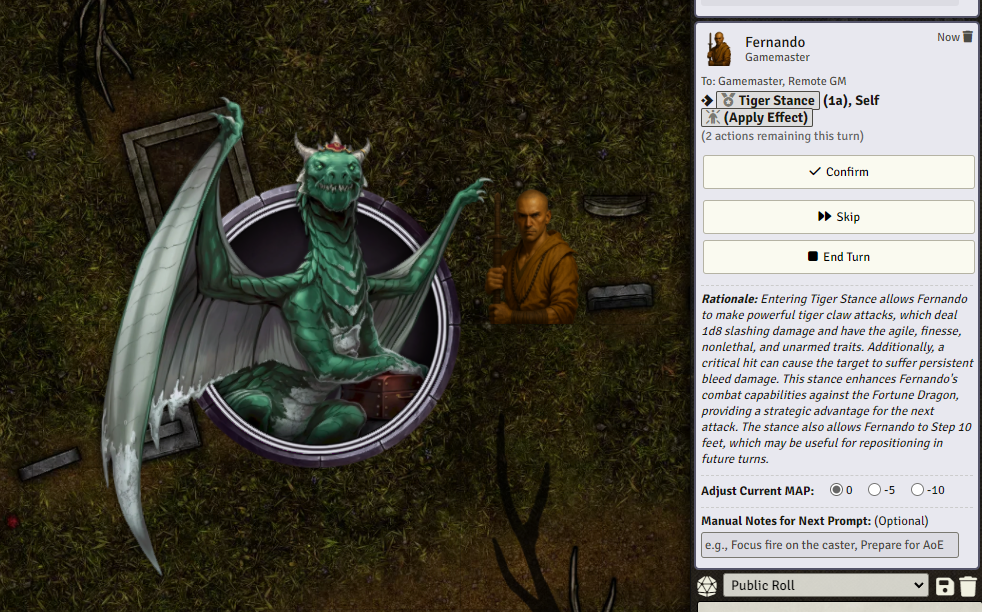

An AI-powered combat assistant module for Pathfinder 2e (PF2e) in Foundry Virtual Tabletop.  
This tool analyzes the full combat state and recommends the best action for any creature on their turn—PCs or NPCs—automatically considering:

- All usable **actions**, **reactions**, **spells**, **items**, **feats**, **passives**
- The creature’s **current state** (HP, conditions, resources, effects)
- **Enemies**, **allies**, **positioning**, and more

Designed for **GMs who want smarter, faster combat** or for **players who want guidance**, the assistant runs **any** creature competently—even optimally.

---

## Features

- ✅ Tactical suggestions based on the full Foundry combat state
- ✅ Rules-aware logic using PF2e-specific traits and keywords
- ✅ Supports player characters, NPCs, monsters, and summons
- ✅ Tracks and uses actions, spell slots, MAP, cooldowns, and conditions
- ✅ Offers flexible GM control: skip, confirm, override, or steer behavior
- ✅ Optional per-player instructions to customize behavior
- ✅ Rich rationale and turn summaries for every decision

---

## Requirements

- Foundry VTT **v12+**
- Pathfinder Second Edition (PF2e) game system installed
- An API key for a supported LLM provider (e.g. OpenAI)

---

## Installation

1. Clone or download this repository.
2. Place the folder in your Foundry modules directory:
   ```
   C:\Users\<YourName>\AppData\Local\FoundryVTT\Data\modules\
   ```
3. Ensure the folder is named `pf2e-ai-combat-assistant`.
4. Launch Foundry VTT and enable **PF2e AI Combat Assistant** under Game Settings > Manage Modules.

---

## 📘 How to Use

### 0. Set Up the LLM Connection

Before use, go to **Game Settings > PF2e AI Combat Assistant** and configure your LLM:

- Enter your **API key**
- Choose the **endpoint** (e.g. OpenAI’s chat endpoint)
- Set a **model name** (e.g. `gpt-4o`)

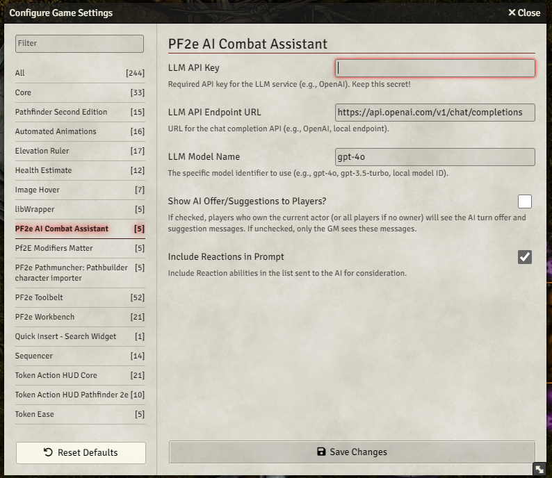

---

### 1. Add Creatures to Combat

Select each token and click the **Toggle Combat State** icon to add them to the tracker.

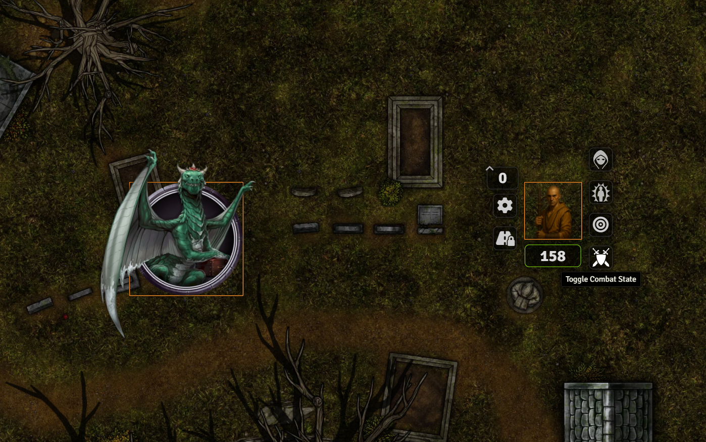

---

### 2. Assign Designations

When combat begins, assign each combatant as **Friendly** or **Enemy**.


You can also assign designations **mid-combat** when new creatures are added.  
The system will prompt you to assign Friendly or Enemy roles as needed to keep tactics accurate.


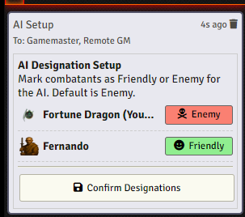

---

### 3. Roll Initiative and Start

Roll initiative as usual, then click **Begin Encounter**.


---

### 4. Choose to Use AI Suggestions

At the start of a turn, you’ll be prompted to let the AI assist.

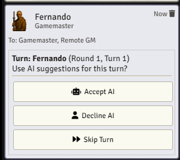

---

### 5. Follow or Skip Suggestions

Each suggestion includes a recommended action and a short explanation.

You are responsible for **executing the suggested action manually** in Foundry (e.g. clicking Strike, Cast, or using an Item).  
Once you've done that, click:

- ✅ **Confirm** to proceed to the next suggestion
- 🔁 **Skip** to reject and get a different suggestion
- ⏹ You may **End Turn** if the creature is done

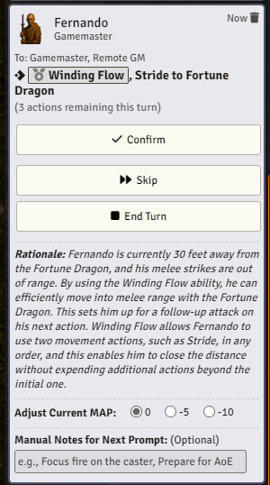

---

### 6. Continue Until Turn End

The AI provides new suggestions after each confirmation. It automatically tracks the creature’s action count.


---

### 7. Strikes, Spells, and Items

When actions involve clickable Foundry elements (like attacks or spells), you’ll get linked buttons.  
Be sure to target the correct token in Foundry before clicking Strike or Cast.

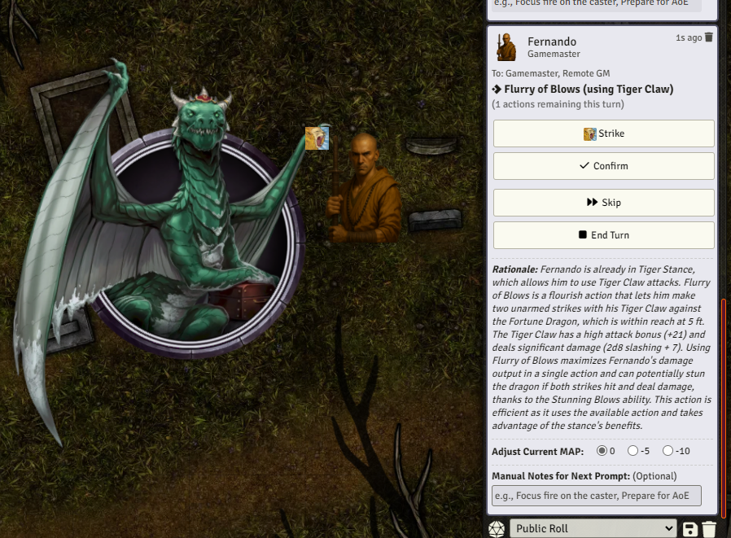

---

### 8. Turn Summary

At the end of the turn, the system generates a **narrative summary** using the chat log to determine which actions succeeded.

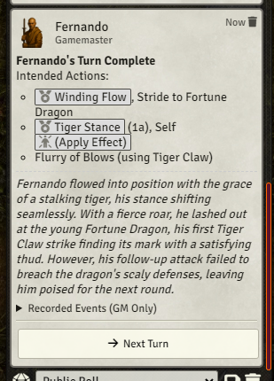

---

## 🧠 Behind the Scenes

- The system auto-increments **Multiple Attack Penalty (MAP)** after confirming an action with the `Attack` trait.
- You can manually override the MAP if needed at any time:
  
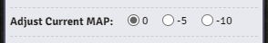

- It tracks every action, spell, ability, item, and effect a creature has—PC or NPC.
- Run any creature competently (even optimally) with minimal prep.

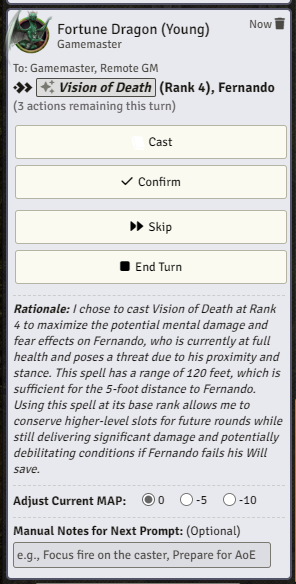  
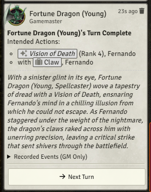

---

## ✍️ Advanced Features

### Manual Notes

You can provide extra context (e.g. resistances, tactics, special terrain) via notes before the next suggestion.

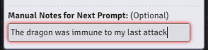

---

### Permanent PC Notes

For PCs, click **AI Notes** on their sheet to define behavior that is always applied—great for describing combat roles or special tactics.

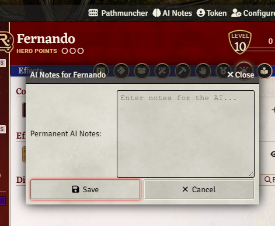

---

Let me know if you have feature requests or bugs to report!
